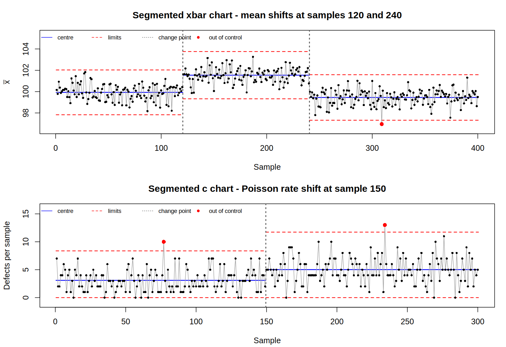

# segqcc

<!-- badges: start -->
[](LICENSE)
<!-- badges: end -->

**Change-point segmented control charts for R.**

A classical control chart compares every sample against one global set of
limits. When the process trends or switches regime, those limits stop
describing it: the chart floods with alarms that say only "the process moved",
which you already knew.

`segqcc` detects the change points in the charted statistic with the
[`changepoint`](https://cran.r-project.org/package=changepoint) package and
rebuilds the [`qcc`](https://cran.r-project.org/package=qcc) chart with the
centre and the control limits **recomputed inside each homogeneous segment**,
so each sample is judged against the limits that actually applied to it.



## Installation

```r
# install.packages("remotes")
remotes::install_github("chrglez/segqcc")
```

## Usage

```r
library(segqcc)

fit <- segmented_qcc(segxbar$value, type = "xbar", sample = segxbar$sample)
fit
#> Segmented xbar control chart
#> ----------------------------------------
#> Samples:        400
#> Change points:  120, 240
#> Segments:       3
#> Out of control: 1 of 400 samples (0.25%)
#>
#>   from  to n_samples   LCL center   UCL n_out limits_from
#> 1    1 120       120 97.83  99.93 102.0     0     segment
#> 2  121 240       120 99.33 101.50 103.8     0     segment
#> 3  241 400       160 97.32  99.45 101.6     1     segment

plot(fit)
```

The returned object is an ordinary `qcc` object carrying per-sample limits, so
anything that works on a `qcc` chart still works, plus `$change.points`,
`$segments` and `$out_of_control`.

## Chart types

| `type` | Chart | Series | Required argument |
|---|---|---|---|
| `"xbar"` | X-bar | grouped samples, n ≥ 2 | `sample` |
| `"R"` | range | grouped samples, 2 ≤ n ≤ 25 | `sample` |
| `"S"` | standard deviation | grouped samples, n ≥ 2 | `sample` |
| `"xbar.one"` | individuals | one observation per sample | — |
| `"p"` | proportion defective | counts | `sizes` |
| `"np"` | number defective | counts | `sizes` |
| `"c"` | defects per sample | counts, constant inspection unit | — |
| `"u"` | defects per unit | counts, varying inspection size | `area` |

The R chart is limited to n ≤ 25 because `qcc` tabulates its d2/d3 constants no
further; for larger samples use `"S"`, which has a closed form for any n.

## Designed for arbitrary series

The package is meant to be pointed at whatever series you have, so the awkward
cases are part of the contract rather than an afterthought.

**Standardisation.** `changepoint`'s normal-likelihood cost assumes a
unit-variance series, so a statistic on any other scale is over-segmented. On a
homogeneous N(100, σ) series of 400 samples, `cpt.mean` alone reports:

| σ of the series | spurious change points | with `segqcc` |
|---|---|---|
| 1 | 0.0 | 0.0 |
| 2 | 6.2 | 0.0 |
| 5 | 103.2 | 0.0 |
| 20 | 166.4 | 0.0 |

*(PELT/MBIC, `minseglen = 2`, mean over 25 replicates.)*

`segmented_qcc()` standardises the statistic before detection (by default with
the moving-range estimate of sigma, which — unlike `sd()` — is not inflated by
the very shifts being looked for). Detection becomes invariant to the units of
your data, at no cost in power. Change points are positions, so nothing has to
be mapped back: the limits are always recomputed from the original data.

**Graceful degradation.** A series too short to split, a constant statistic, a
`min_seg_len` larger than the series, or a detector that refuses the data does
not raise an error. You get an ordinary single-segment control chart, a
warning, and the reason recorded in `$notes`:

```r
segmented_qcc(c(3, 5, 4, 6), type = "c", min_seg_len = 3)
#> Segmented c control chart
#> ----------------------------------------
#> Samples:        4
#> Change points:  none detected
#> Segments:       1
#> Out of control: 0 of 4 samples (0%)
#>
#>   from to n_samples LCL center   UCL n_out limits_from
#> 1    1  4         4   0    4.5 10.86     0     segment
#>
#> Notes:
#>  - the series has 4 sample(s) but min_seg_len = 3 needs at least 6 for a
#>    split; change-point detection was skipped and a single segment returned
```

The same applies per segment: one that `qcc` cannot refit on its own falls back
to the limits of the whole series, flagged in the `limits_from` column, rather
than aborting the call.

**Sample order.** Samples are ordered by *first appearance*, so any labels work
— integers with gaps, characters, factors — and the time order of your data is
never silently permuted.

## Tuning

| Argument | Purpose |
|---|---|
| `method` | search method: `"PELT"` (default), `"AMOC"`, `"BinSeg"`, `"SegNeigh"` |
| `penalty`, `pen_value` | detection penalty; `"MBIC"` by default |
| `cpt_stat` | look for a change in `"mean"`, `"var"` or `"meanvar"` |
| `scale` | `"mr"` (default), `"sd"` or `"none"` standardisation |
| `min_seg_len` | minimum segment length, in samples |
| `nsigma` | width of the control limits, in standard errors |

## Data

`segxbar` (400 samples of 8, mean shifts at 120 and 240), `segind` (400 samples
of 1, shifts at 150 and 250), `segp` (300 samples of 50, defect rate 0.05 →
0.09 at 150) and `segc` (300 Poisson samples, rate 3 → 5 at 150). All simulated
and deterministic; see `tools/generate_data.R`.

## Authors

Christian González-Martel and Jaime Pinilla Domínguez
(Universidad de Las Palmas de Gran Canaria).

## License

MIT — see [LICENSE](LICENSE).
